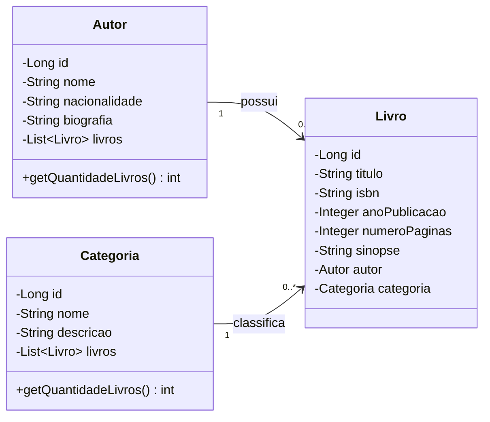

# Diagrama de Classes — Sistema Biblioteca

## Relacionamentos

| Relacionamento | Tipo | Descrição |
|---|---|---|
| Autor → Livro | OneToMany | Um autor pode ter muitos livros |
| Categoria → Livro | OneToMany | Uma categoria agrupa muitos livros |
| Livro → Autor | ManyToOne | Cada livro pertence a um único autor |
| Livro → Categoria | ManyToOne | Cada livro pertence a uma única categoria |

## Regras de negócio

- Um **Autor** não pode ser deletado se possuir livros associados
- Uma **Categoria** não pode ser deletada se possuir livros associados
- **ISBN** deve ser único por livro
- **Nome** da categoria deve ser único
